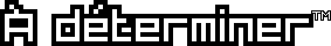
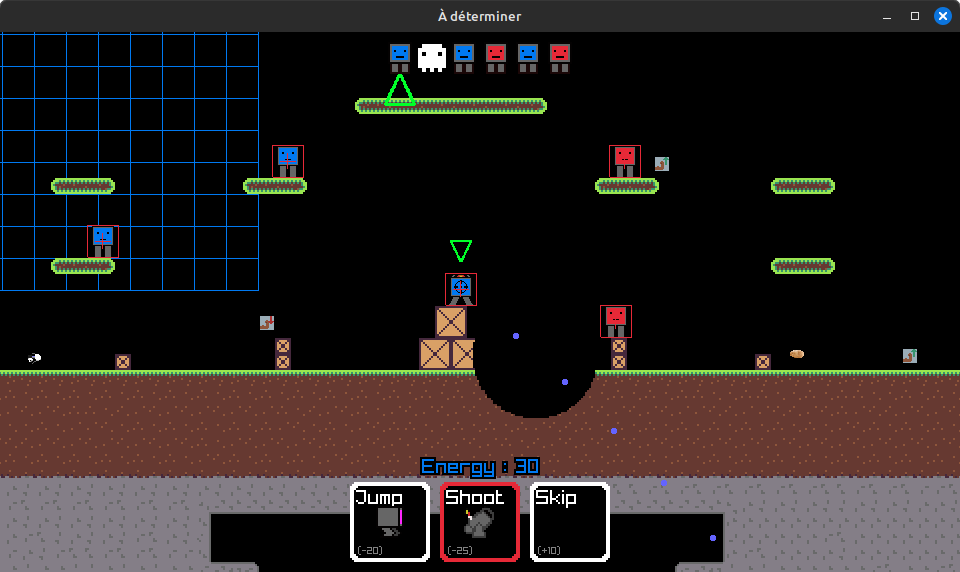
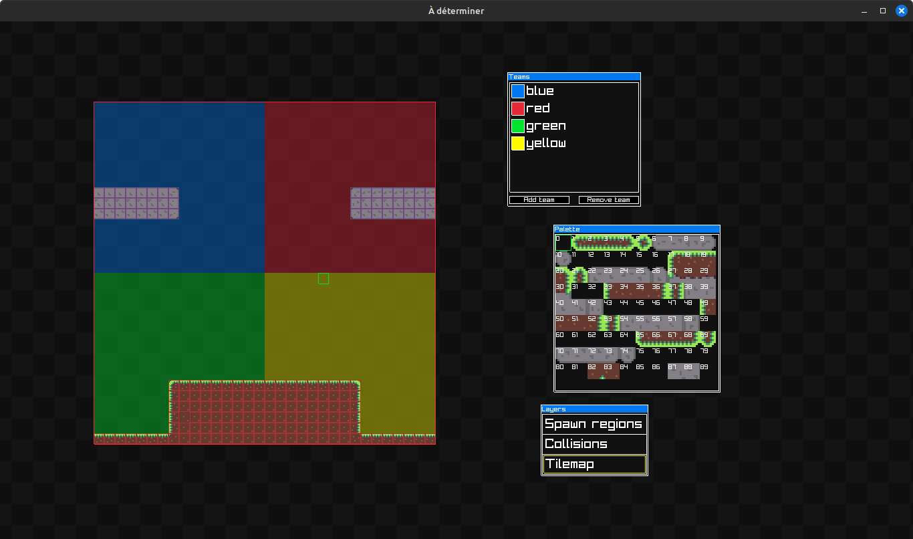

-------------------------

(This is a rewrite in c++ of "À déterminer", a game we made for school, [originally in python](https://github.com/orwenn22/a_determiner_py))

A relatively up do date wasm build is [playable here](https://orwenn22.github.io/adeterminer/adeterminer.html).

## Building the game (desktop)

Your compiler must support at least c++17. Probably.

To build from source, you can setup the repository by doing the following :

```shell
git clone https://github.com/orwenn22/a_determiner_cpp
cd a_determiner_cpp
git clone https://github.com/raysan5/raylib
```

Then, to build it, you can import the cmake project in an IDE that supports it, or do the following (linux) :

```shell
mkdir build
cd build
cmake ..
make -j7
```

## Building the game (wasm/emscripten)

First go into ./raylib/src then build it by following [the official instructions](https://github.com/raysan5/raylib/wiki/Working-for-Web-(HTML5)#21-command-line-compilation).
Then, go back in the root of the repository and type the following :

```shell
python ./gen_wasm_makefile.py
make -f ./wasm_auto.Makefile
python -m http.server
```

## Differences with the python version

A lot of stuff was rewritten in a better way (some parts of it still suck tho). 
There are also a few new features such as the ability to have more than two teams and a built-in map editor.


## Screenshots






## Authors

The python version of the game was made by [DAlexis1](https://github.com/DAlexis1), [AppleJude](https://github.com/AppleJude) 
and [orwenn22](https://github.com/orwenn22) (me). After the original version was completed, I decided to rewrite it in c++ in my
free time.
